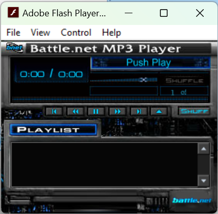

========================
Arreat Summit MP3 Player
========================

The Arreat Summit includes a basic MP3 player coded in Flash. It's conceptually simple:

#.  Sound metadata (title, arist, MP3 URL) is stored in an XML file that is hosted on their server. This makes adding and removing music trivial
#.  The MP3 URL points to an MP3 file hosted on their server. These files still exist despite the fact that the player is unusable!
#.  A simple Flash program plays music from that URL using the built-in AS2 Sound class. It also handles the playlist, showing title and artist, and transport controls. This could probably be pretty easily replaced with a network playlist for VLC, or a custom HTML5 client.

If you go to `Arreat Summit <http://classic.battle.net/diablo2exp/files.shtml#>`_ and click on the MP3 player link it will open a new window at http://classic.battle.net/window.shtml.

------------
window.shtml
------------

.. note:: The .shtml extension means the file has `Server Side Includes <https://en.wikipedia.org/wiki/Server_Side_Includes>`_. This is meaningless to the user...

Here is the entire source

.. code-block:: html

    <!DOCTYPE html PUBLIC "-//W3C//DTD XHTML 1.0 Transitional//EN" "http://www.w3.org/TR/xhtml1/DTD/xhtml1-transitional.dtd">
    <html xmlns="http://www.w3.org/1999/xhtml" xml:lang="en" lang="en">
    <head>
    <meta http-equiv="Content-Type" content="text/html; charset=iso-8859-1" />
    <title>Battle.net Sound Player</title>
    </head>
    <body bgcolor="#999999">
    <!--url's used in the movie-->
    <!--text used in the movie-->
    <!--
    1
    -->
    <object classid="clsid:d27cdb6e-ae6d-11cf-96b8-444553540000" codebase="http://download.macromedia.com/pub/shockwave/cabs/flash/swflash.cab#version=6,0,0,0" width="283" height="227" id="player" align="middle">
    <param name="allowScriptAccess" value="sameDomain" />
    <param name="movie" value="player.swf" />
    <param name="quality" value="high" />
    <param name="bgcolor" value="#999999" />
    <param name='menu' value='false'>
    <embed src="player.swf" quality="high" bgcolor="#999999" width="283" height="227" name="player" align="middle" allowScriptAccess="sameDomain" type="application/x-shockwave-flash" pluginspage="http://www.macromedia.com/go/getflashplayer" />
    </object>
    </body>
    </html>

This may look like a gray square but... wait...

Uh oh! Flash!

----------
player.swf
----------

Download: http://classic.battle.net/player.swf

.. tip:: New to Flash decompiling? Consider :doc:`../programming/jpexs-free-flash-decompiler`

There's a script on Frame 1 that, when loaded, sets ``_global.xml_location = "sounds.xmls";``

There's a ``load`` script on Frame 2 for ``myLoadVar`` that parses the XML:

.. code-block:: actionscript

    onClipEvent(load){
        _root.nextSong = 0;
        _root.playing = 0;
        _soundbuftime = 5;
        _root.songList = new XML();
        _root.songList.ignoreWhite = true;
        _root.songList.onLoad = function(success)
        {
            var _loc1_ = _root;
            if(success)
            {
                _loc1_.numberOfSongs = _loc1_.songList.firstChild.childNodes.length;
                _loc1_.indexSongNumber = _loc1_.numberOfSongs - 1;
                a = 0;
                while(a < _loc1_.numberOfSongs)
                {
                    _loc1_["song" + a] = new Sound();
                    _loc1_["xmlSong" + a] = _loc1_.songList.firstChild.childNodes[a].childNodes[1].childNodes;
                    _loc1_["xmlArtistName" + a] = _loc1_.songList.firstChild.childNodes[a].childNodes[2].childNodes;
                    _loc1_["xmlSongTitle" + a] = _loc1_.songList.firstChild.childNodes[a].childNodes[0].childNodes;
                    _loc1_.songBox.song_list.addItem(_loc1_["xmlSongTitle" + a],a);
                    a++;
                }
            }
            else
            {
                trace("not loaded yet");
            }
        };
        _root.songList.load(_global.xml_location);
    }

.. tip:: Here's the docs for ``Sound``: https://open-flash.github.io/mirrors/as2-language-reference/Sound.html

This is what happens when you click the Play button:

.. code-block:: actionscript

    on(press){
        _global.ogre = "go";
        if(_root.paused != 1 && _root.playing != 1)
        {
            stopAllSounds();
            if(_root.randomPlay == 1)
            {
                if(_root.nextRandomSong > _root.numberOfSongs)
                {
                    _root.nextRandomSong = 0;
                }
                _root.nextSong = _root.myRandomArray[_root.nextRandomSong];
                _root.nextRandomSong = _root.nextRandomSong + 1;
            }
            _root["song" + _root.nextSong].loadSound(_root["xmlSong" + _root.nextSong],true);
            stopAllSounds();
            _root["song" + _root.nextSong].start(0,0);
            _root.playing = 1;
            _root.paused = 0;
            _root.songBox.song_list.setScrollPosition(_root.nextSong);
            _root.songBox.song_list.setSelectedIndex(_root.nextSong);
        }
        else
        {
            _root["song" + _root.nextSong].start(_root.pausePosition,0);
            _root.playing = 1;
            _root.paused = 0;
        }
        _root.btnInfoText = _global.pause_btn;
        _root.playpause.gotoAndStop("pause-roll");
    }

-----------
sounds.xmls
-----------

Download: http://classic.battle.net/sounds.xmls

Schema:

.. code-block:: xml

    <?xml version="1.0" encoding="UTF-8"?>
    <root>

    <audio>
      <title>SC: StarCraft Title Screen</title>
      <audioURL>/supersecrest/title.mp3</audioURL>
      <artist>StarCraft Soundtrack</artist>
    </audio>
    <!-- <audio> is repeated, once per track -->

    </root>

That example points to http://classic.battle.net/supersecrest/title.mp3

.. note:: Yes, it's ``supersecrest`` (notice the ``s`` as the second-last character). No, I don't know why it looks like someone misspelled ``supersecret`` or ``supersecrets``. Unless it's a joke: the misspelling makes it more super-secret that usual.

Downloading
===========

Here's a simple Python program that walks the tree and downloads each track:

.. code-block:: python

    import sys
    import urllib.parse
    import urllib.request
    import xml.etree.ElementTree as ET
    from pathlib import Path

    _HOST = 'http://classic.battle.net'

    def main() -> int:
        # Download http://classic.battle.net/sounds.xmls
        tree = ET.parse('sounds.xmls')
        root = tree.getroot()

        for audio in root.findall('audio'):
            audio_url = audio.find('audioURL').text
            host_url = _HOST + audio_url
            print(host_url)
            name = Path(audio_url).name
            with urllib.request.urlopen(host_url) as http:
                with Path(name).open('wb') as f:
                    f.write(http.read())

        return 0

    if __name__ == '__main__':
        sys.exit(main())

-------
Running
-------

You can get this working:

#.  Download `player.swf <http://classic.battle.net/player.swf>`_ and `sounds.xmls <http://classic.battle.net/sounds.xmls>`_
#.  Put ``player.swf`` and ``sounds.xmls`` in the same directory
#.  Modify ``<audioURL>`` in ``sounds.xmlns``. Currently it's treated as an absolute path to Unix root ``/supersecrest/foo.mp3``. You can use any path you want; the simplist (fewest modifications) is local relative files with ``./supersecrest/foo.mp3`` or ``supersecrest/foo.mp3``. You can download the MP3s using the sample Python script above. (Unfortunately, it doesn't work with files hosted on ``http://classic.battle.net/supersecrest/foo.mp3`` due to sandboxing and Flash security.)
#.  Launch the projector.
#.  Open ``player.swf``
