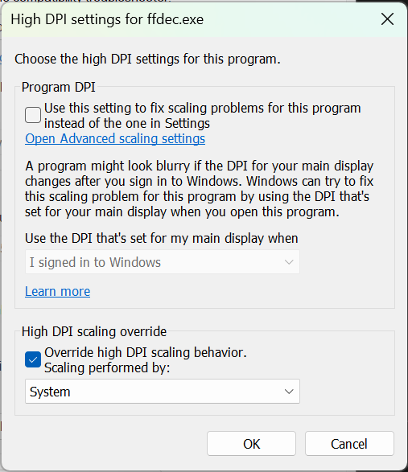

===========================
JPEXS Free Flash Decompiler
===========================

Download: https://github.com/jindrapetrik/jpexs-decompiler

I've been using this Flash decompiler forever. Like 10 years.

If you use a high-DPI monitor, consider using the System scaling override:

----------------
Install Location
----------------

``C:\Program Files (x86)\FFDec``

---------
Debugging
---------

If you click the Run button (F6) it will open a dialog to point to a "projector". There's a link at the bottom of the dialog which goes to an archive.org cache of the old Adobe downloads. These are stand-alone binaries (no installer) so put them some place memorable.